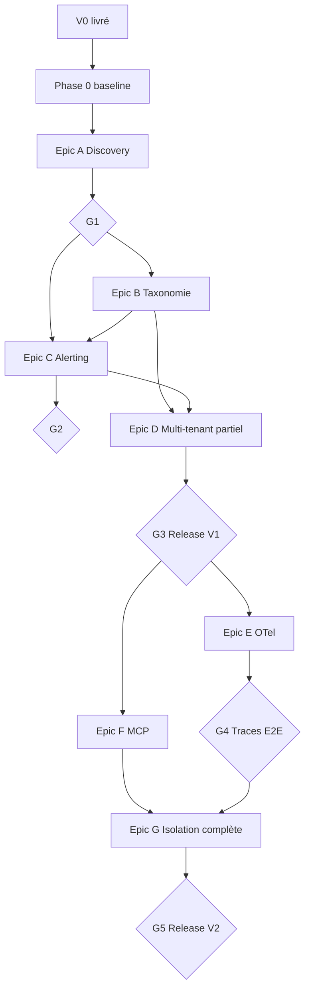

# VIGIE — Roadmap & plan intégral V0 → V2

**De la V0 (prototype) à la V2 complète (plateforme)**
Statut : Plan de développement | Juillet 2026 | Réf. : `VIGIE_Specs_V0.md` → `VIGIE_Specs_Cible.md`

---

## Sommaire

1. [Point de départ — V0](#1-point-de-départ--v0-livré)
2. [Vue d'ensemble](#2-vue-densemble)
3. [Calendrier macro (22 semaines)](#3-calendrier-macro-22-semaines)
4. [Phase 0 — Consolidation V0](#4-phase-0--consolidation-v0-semaines-s0s1)
5. [Phase 1 — V1 développement](#5-phase-1--v1-développement-semaines-s2s11)
6. [Phase 2 — V1 recette & release](#6-phase-2--v1-recette--release-semaines-s10s12)
7. [Phase 3 — V2 développement](#7-phase-3--v2-développement-semaines-s13s20)
8. [Phase 4 — V2 recette & release](#8-phase-4--v2-recette--release-semaines-s19s22)
9. [Backlog complet](#9-backlog-complet)
10. [Charge & ressources](#10-charge--ressources)
11. [Jalons & gates](#11-jalons--gates)
12. [Exigences non fonctionnelles](#12-exigences-non-fonctionnelles--suivi)
13. [Risques](#13-risques)
14. [Références](#14-références)

---

## 1. Point de départ — V0 (livré)

État actuel du dépôt : stack Docker Compose opérationnelle, agent conversationnel, collecte zéro-code.

| Capacité | Statut | Détail |
|---|---|---|
| Collecte logs + métriques OS | ✅ | Vector → Loki, node-exporter → Prometheus |
| Normalisation + masquage PII | ✅ | Transforms VRL, label `projet` constant |
| Classification métier naïve | ✅ | Mots-clés figés → `stream_type` |
| Agent diagnostic (`/ask`) | ✅ | Sonnet, boucle Plan-Exécute-Vérifie, outils Loki/PromQL |
| Rapport quotidien (`/report/daily`) | ✅ | Synthèse 24h technique + métier inféré |
| Grafana dashboards | ✅ | Port 3000 |
| Configuration manuelle | ⚠️ Friction | `config/vector.toml` à adapter par projet |
| Triage continu (Haiku) | ❌ | Variable `MODEL_TRIAGE` réservée, non branchée |
| Alerting proactif | ❌ | Agent purement réactif |
| Discovery automatique | ❌ | — |
| Multi-tenant | ❌ | Label `projet` = constante |
| Tracing OTel | ❌ | — |
| Serveur MCP | ❌ | — |

**Invariants** (toute la roadmap) :
- Zéro modification du code applicatif (SDK OTel = option V2 uniquement)
- Le LLM n'analyse jamais le flux brut
- Déploiement self-hosted par défaut
- Distinction faits observés / hypothèses dans toutes les sorties

---

## 2. Vue d'ensemble

```
V0 (fait)     Phase 0        Phase 1–2 (V1)              Phase 3–4 (V2)
────────      ───────        ──────────────              ──────────────
Prototype  →  Pilote +    →  Discovery                   SDK OTel
              baseline        Taxonomie métier            Serveur MCP
                              Alerting proactif           Multi-tenant complet
                              Multi-tenant partiel
```

| Phase | Période | Durée | Livrable |
|---|---|---|---|
| **0** — Consolidation V0 | S0–S1 | 2 sem. | Baseline mesurée, pilote V0 validé |
| **1** — V1 dev | S2–S11 | 10 sem. | Discovery, taxonomie, alerting, tenant partiel |
| **2** — V1 recette | S10–S12 | 3 sem. (chevauchement) | V1 prête à vendre |
| **3** — V2 dev | S13–S20 | 8 sem. | OTel, MCP, isolation complète |
| **4** — V2 recette | S19–S22 | 4 sem. (chevauchement) | V2 plateforme complète |

**Horizon total** : ~22 semaines (~5,5 mois) à partir de juillet 2026 → **fin novembre 2026**.

---

## 3. Calendrier macro (22 semaines)

| Semaine | Dates (2026) | Focus principal | Epic(s) | Gate |
|---|---|---|---|---|
| **S0** | 7–11 juil. | Pilote V0, baseline LLM/volumétrie | — | G0 |
| **S1** | 14–18 juil. | Refactoring agent (structure V1), persistance | H | — |
| **S2** | 21–25 juil. | Discovery : scan read-only | A | — |
| **S3** | 28 juil.–1 août | Discovery : inférence LLM + génération config | A | — |
| **S4** | 4–8 août | CLI `vigie discover` + validation Symfony | A | G1 |
| **S5** | 11–15 août | Taxonomie : échantillonnage + proposition LLM | B | — |
| **S6** | 18–22 août | Taxonomie : génération VRL + rapport enrichi | B | — |
| **S7** | 25–29 août | Alerting : job seuils + triage Haiku | C | — |
| **S8** | 1–5 sept. | Alerting : escalade Sonnet + Slack/email | C | — |
| **S9** | 8–12 sept. | Alerting : API + persistance anomalies | C | G2 |
| **S10** | 15–19 sept. | Multi-tenant partiel + budget LLM | D | — |
| **S11** | 22–26 sept. | Grafana tenant + durcissement transversal | D, H | — |
| **S12** | 29 sept.–3 oct. | **Recette V1** — pilotes taxonomie + TMA alerting | — | **G3 V1** |
| **S13** | 6–10 oct. | OTel : choix stack + collecteur Tempo | E | — |
| **S14** | 13–17 oct. | OTel : SDK Symfony + docker-compose | E | — |
| **S15** | 20–24 oct. | OTel : corrélation trace_id + outil agent | E | G4 |
| **S16** | 27–31 oct. | MCP : serveur + auth jetons | F | — |
| **S17** | 3–7 nov. | MCP : 4 outils + intégration proto-factory | F | — |
| **S18** | 10–14 nov. | Multi-tenant complet : tests non-fuite | G | — |
| **S19** | 17–21 nov. | OTel Node + isolation traces | E, G | — |
| **S20** | 24–28 nov. | Durcissement V2, doc commerciale | H | — |
| **S21** | 1–5 déc. | **Recette V2** — pilote OTel + MCP E2E | — | — |
| **S22** | 8–12 déc. | Corrections finales, release V2 | — | **G5 V2** |

---

## 4. Phase 0 — Consolidation V0 (semaines S0–S1)

**Objectif** : valider le prototype sur un vrai projet, mesurer les bases, préparer le socle technique V1.

### S0 — Pilote & baseline

| ID | Tâche | Effort | Rôle | Livrable |
|---|---|---|---|---|
| P0.1 | Sélectionner 1 projet pilote ETECH (Symfony prioritaire) | 0,5 j | Product | Fiche pilote signée |
| P0.2 | Adapter `vector.toml` + volumes docker-compose sur pilote | 1 j | Ops | Collecte opérationnelle |
| P0.3 | Mesurer volumétrie logs (lignes/j, taille/j) sur 7 jours | 0,5 j | Ops | Rapport volumétrie |
| P0.4 | Calibrer rétention Loki selon volumétrie | 0,5 j | Dev infra | Config Loki dimensionnée |
| P0.5 | Instrumenter compteur tokens LLM (`/ask`, `/report/daily`) | 1 j | Dev backend | Métriques tokens/appel |
| P0.6 | Baseline coût LLM sur 2 semaines pilote | 0,5 j | Product | Chiffre €/mois de référence |
| P0.7 | Tester 10 scénarios `/ask` réalistes sur pilote | 1 j | Product + Dev | Grille qualité diagnostic |
| P0.8 | Documenter runbook install V0 (constat friction `vector.toml`) | 0,5 j | Ops | Runbook v0.1 |

**Gate G0** (fin S0) : collecte stable ≥ 7 jours, baseline LLM documentée, friction install quantifiée (temps manuel actuel).

### S1 — Socle technique V1

| ID | Tâche | Effort | Rôle | Livrable |
|---|---|---|---|---|
| P0.9 | Refactoriser `agent/main.py` en modules (`tools/`, `models/`, `routes/`) | 2 j | Dev backend | Structure extensible |
| P0.10 | Ajouter persistance SQLite (anomalies, config, tenants — schéma V1) | 2 j | Dev backend | `agent/db/` + migrations |
| P0.11 | CI basique : lint + tests unitaires outils Loki/PromQL | 1 j | Dev backend | GitHub Actions / CI interne |
| P0.12 | Package CLI `vigie` (structure Click/Typer, stub `discover`) | 1 j | Dev backend | `cli/` installable |
| P0.13 | Préparer environnements pilotes #2 (Laravel) et #3 (Node) | 1 j | Ops | 2 hôtes/conteneurs prêts |

---

## 5. Phase 1 — V1 développement (semaines S2–S11)

### Epic A — Discovery automatique (S2–S4)

| ID | Tâche | Sem. | Effort | Dépendances |
|---|---|---|---|---|
| A.1.1 | Module scan chemins logs (`/var/log`, `storage/logs`, `var/log`, conteneurs) | S2 | 2 j | P0.12 |
| A.1.2 | Détection services actifs (ports, processus, conteneurs Docker) | S2 | 1,5 j | A.1.1 |
| A.1.3 | Garde-fous read-only (audit actions, pas d'écriture hôte) | S2 | 1 j | A.1.1 |
| A.2.1 | Échantillonneur N premières lignes par source (configurable) | S3 | 1 j | A.1.2 |
| A.2.2 | Prompt inférence format (JSON/texte/framework) → rapport structuré | S3 | 2 j | A.2.1 |
| A.2.3 | Détection schéma DB (ports MySQL/PG, fichiers `.env` montés — read-only) | S3 | 1 j | A.1.2 |
| A.3.1 | Template Jinja2 → génération `vector.toml` proposé | S3 | 2 j | A.2.2 |
| A.3.2 | Mode preview : diff vs config existante | S4 | 1 j | A.3.1 |
| A.4.1 | CLI `vigie discover --target` + rapport Markdown/JSON | S4 | 1,5 j | A.3.1 |
| A.4.2 | Endpoint `POST /discover` (option API) | S4 | 1 j | A.4.1 |
| A.5.1 | Validation stack Symfony (pilote #1) | S4 | 1 j | A.4.1 |
| A.5.2 | Validation stack Laravel (pilote #2) | S4 | 1 j | A.4.1 |
| A.5.3 | Validation stack Node (pilote #3) | S4 | 1 j | A.4.1 |

**Gate G1** (fin S4) : Discovery produit une config utilisable sans retouche majeure sur 3 stacks.

---

### Epic B — Classification métier apprise (S5–S6 + pilotes S12)

| ID | Tâche | Sem. | Effort | Dépendances |
|---|---|---|---|---|
| B.1.1 | Job extraction échantillon Loki (fenêtre 3–7 j, stratifié par level) | S5 | 1,5 j | P0.10 |
| B.1.2 | Déduplication + anonymisation avant envoi LLM | S5 | 1 j | B.1.1 |
| B.2.1 | Prompt proposition taxonomie (événements métier candidats + exemples) | S5 | 2 j | B.1.2 |
| B.2.2 | Format fichier taxonomie (`taxonomy.yaml` versionné) | S5 | 0,5 j | B.2.1 |
| B.3.1 | CLI `vigie taxonomy propose\|validate\|apply` | S5 | 1,5 j | B.2.2 |
| B.3.2 | Guide atelier validation (30 min client) | S5 | 0,5 j | Product |
| B.4.1 | Générateur transform VRL depuis taxonomie validée | S6 | 2 j | B.3.1 |
| B.4.2 | Label `business_event_type` + rétrocompat `stream_type` | S6 | 1 j | B.4.1 |
| B.5.1 | Enrichir `/report/daily` avec KPIs taxonomie | S6 | 2 j | B.4.2 |
| B.5.2 | Dashboard Grafana « événements métier » par tenant | S6 | 1 j | B.4.2, D.3 |
| B.6.1 | Job révision périodique + diff taxonomie avant apply | S6 | 1,5 j | B.4.1 |
| B.7.1 | **Pilote** : atelier taxonomie projet #1 (GPAO ou équivalent) | S12 | 1 j | Product + client |
| B.7.2 | **Pilote** : atelier taxonomie projet #2 | S12 | 1 j | Product + client |

---

### Epic C — Triage continu & alerting proactif (S7–S9 + pilote S12)

| ID | Tâche | Sem. | Effort | Dépendances |
|---|---|---|---|---|
| C.1.1 | Scheduler APScheduler (ou cron sidecar) intervalle 5–15 min | S7 | 1 j | P0.10 |
| C.1.2 | Règles seuils par défaut : taux erreur HTTP, pic `level=error`, CPU/RAM/disque | S7 | 2 j | C.1.1 |
| C.1.3 | Règles seuils métier (volumes `business_event_type` anormaux) | S7 | 1 j | B.4.2 |
| C.2.1 | Pipeline triage Haiku (`MODEL_TRIAGE`) — prompt qualification | S7 | 1,5 j | C.1.2 |
| C.2.2 | Cache « bruit connu » (même signature → pas de re-escalade 24h) | S8 | 1 j | C.2.1 |
| C.3.1 | Escalade Sonnet : réutiliser boucle agentique existante | S8 | 1,5 j | C.2.1 |
| C.3.2 | Template alerte NL (faits / hypothèses / actions suggérées) | S8 | 1 j | C.3.1 |
| C.4.1 | Adapter Slack (webhook) + email (SMTP/webhook) | S8 | 1,5 j | C.3.2 |
| C.5.1 | Anti-spam : 1 alerte/type/fenêtre + backoff exponentiel | S9 | 1 j | C.4.1 |
| C.5.2 | Dashboard qualité alertes (accepté/rejeté/ignoré) | S9 | 1 j | C.5.1 |
| C.6.1 | `POST/GET /alerts/config` — seuils + canaux par tenant | S9 | 1,5 j | C.1.2 |
| C.6.2 | `GET /alerts/history` — pagination, filtres statut | S9 | 1 j | C.6.1 |
| C.7.1 | Modèles `anomaly`, `alert_rule` + persistance SQLite | S9 | 1 j | P0.10 |
| C.7.2 | Statuts anomaly : `open`, `investigating`, `resolved`, `ignored` | S9 | 0,5 j | C.7.1 |
| C.8.1 | **Pilote TMA** : alerting 2 semaines en conditions réelles | S12 | 2 j | Ops + client |

**Gate G2** (fin S9) : alerting E2E fonctionnel en labo (seuil → triage → escalade → Slack).

---

### Epic D — Multi-tenant partiel + gouvernance LLM (S10–S11)

| ID | Tâche | Sem. | Effort | Dépendances |
|---|---|---|---|---|
| D.1.1 | Modèle `tenant` (id, nom, config, budget_llm) | S10 | 1 j | P0.10 |
| D.1.2 | Propagation `tenant_id` dans Vector (remplace label `projet`) | S10 | 1,5 j | D.1.1 |
| D.1.3 | Scoping LogQL/PromQL agent — tenant obligatoire | S10 | 1,5 j | D.1.2 |
| D.2.1 | Middleware FastAPI : injection tenant depuis header/token | S10 | 1 j | D.1.3 |
| D.2.2 | Tests intégration 2 tenants — pas de fuite requêtes | S10 | 2 j | D.2.1 |
| D.3.1 | Provisioning dossiers Grafana + datasources filtrées | S11 | 1,5 j | D.1.2 |
| D.3.2 | Permissions Grafana par tenant (viewer/editor) | S11 | 1 j | D.3.1 |
| D.4.1 | Compteur tokens par tenant + plafond configurable | S11 | 1,5 j | P0.5 |
| D.4.2 | Arrêt auto appels LLM si budget dépassé (graceful) | S11 | 1 j | D.4.1 |
| D.5.1 | Test dégradation gracieuse : kill agent, collecte continue | S11 | 0,5 j | — |
| D.5.2 | Doc « instance dédiée vs mutualisée » | S11 | 0,5 j | Product |

---

### Epic H — Transversal V1 (S1, S11–S12)

| ID | Tâche | Sem. | Effort | Rôle |
|---|---|---|---|---|
| H.1 | Runbook install V1 (< 1 jour avec Discovery) | S11 | 1 j | Ops |
| H.2 | Guide opérateur (discover → validate → up) | S11 | 1 j | Product |
| H.3 | Tests E2E docker-compose (health, ask, report, discover) | S11 | 2 j | Dev backend |
| H.4 | Sécurité : revue montages volumes, secrets, auth agent | S11 | 1 j | Dev infra |
| H.5 | Changelog V1 + tag release `v1.0.0` | S12 | 0,5 j | Dev |
| H.6 | Fiche PU V1 (offre vendable, Setup Fee, SLA interne) | S12 | 1 j | Product |

---

## 6. Phase 2 — V1 recette & release (semaines S10–S12)

Chevauchement volontaire avec fin dev (S10–S11) pour ne pas bloquer les pilotes.

### Critères de sortie V1 (Definition of Done)

| # | Critère | Responsable | Semaine cible |
|---|---|---|---|
| 1 | Discovery OK sur Symfony, Laravel, Node | Dev + Ops | S4 (G1), confirmé S12 |
| 2 | Taxonomie validée sur ≥ 2 projets pilotes | Product + client | S12 |
| 3 | Alerting TMA : faux positifs acceptables (≥ 70 % alertes jugées pertinentes) | Product + client | S12 |
| 4 | Coût LLM mensuel mesuré vs estimation cadrage (écart < 30 %) | Product | S12 |
| 5 | Install nouveau projet < 1 jour (mesure sur pilote #3) | Ops | S12 |
| 6 | Tests E2E CI verts | Dev | S11 |
| 7 | Runbook + guide opérateur publiés | Ops + Product | S12 |

**Gate G3 — Release V1** (fin S12, ~3 oct. 2026) : tous critères cochés → tag `v1.0.0`, offre commerciale activable.

---

## 7. Phase 3 — V2 développement (semaines S13–S20)

### Epic E — SDK OpenTelemetry optionnel (S13–S15, S19)

| ID | Tâche | Sem. | Effort | Dépendances |
|---|---|---|---|---|
| E.0.1 | ADR : Tempo vs Jaeger (critères : docker footprint, corrélation Loki) | S13 | 0,5 j | — |
| E.3.1 | Service Tempo (+ otel-collector) dans docker-compose | S13 | 2 j | E.0.1 |
| E.3.2 | Rétention traces + config sampling (100 % erreurs, 10 % OK) | S13 | 1 j | E.3.1 |
| E.1.1 | Package Composer `etech/vigie-otel-symfony` — init + auto-inst. HTTP/SQL | S14 | 3 j | E.3.1 |
| E.1.2 | Doc installation Symfony (3 lignes, upsell séparé) | S14 | 0,5 j | E.1.1 |
| E.4.1 | Enrichissement Vector : extraction `trace_id` des logs JSON | S15 | 1,5 j | E.1.1 |
| E.4.2 | Label Loki `trace_id` + `correlation_id` | S15 | 1 j | E.4.1 |
| E.5.1 | Outil agent `query_traces` (API Tempo) | S15 | 2 j | E.4.2 |
| E.5.2 | Enrichir diagnostic `/ask` et `explain_anomaly` si traces dispo | S15 | 1 j | E.5.1 |
| E.2.1 | Package npm `@etech/vigie-otel` — init Node/Express | S19 | 2 j | E.1.1 |
| E.2.2 | Doc installation Node | S19 | 0,5 j | E.2.1 |
| E.6.1 | **Pilote volontaire** : déploiement SDK sur 1 projet Symfony | S21 | 2 j | Ops + client |

**Gate G4** (fin S15) : trace E2E visible (requête HTTP → trace Tempo → corrélation log).

---

### Epic F — Serveur MCP (S16–S17)

| ID | Tâche | Sem. | Effort | Dépendances |
|---|---|---|---|---|
| F.1.1 | Intégration MCP SDK Python (transport SSE ou stdio configurable) | S16 | 2 j | G3 |
| F.1.2 | Mount MCP sur FastAPI (`/mcp` ou port dédié) | S16 | 1 j | F.1.1 |
| F.6.1 | Auth jeton par tenant (header `Authorization: Bearer`) | S16 | 1,5 j | D.2.1 |
| F.6.2 | ACL : mapping jeton → tenants autorisés | S16 | 1 j | F.6.1 |
| F.2.1 | Outil MCP `get_project_health` (fenêtre temporelle param.) | S17 | 1,5 j | F.1.2 |
| F.3.1 | Outil MCP `query_incidents` (filtres statut, période) | S17 | 1,5 j | C.7.1 |
| F.4.1 | Outil MCP `get_business_kpis` (depuis taxonomie tenant) | S17 | 1,5 j | B.5.1 |
| F.5.1 | Outil MCP `explain_anomaly` (wrapper boucle agentique) | S17 | 2 j | C.3.1 |
| F.7.1 | Config MCP client proto-factory (descripteur outils) | S17 | 1 j | F.2–F.5 |
| F.7.2 | Test E2E : proto-factory appelle `get_project_health` | S17 | 1 j | F.7.1 |
| F.7.3 | Test E2E : proto-factory appelle `explain_anomaly` | S21 | 1 j | F.7.1 |

---

### Epic G — Multi-tenant complet (S18–S19)

| ID | Tâche | Sem. | Effort | Dépendances |
|---|---|---|---|---|
| G.1.1 | Suite tests non-fuite : 10 scénarios cross-tenant | S18 | 2 j | D.2.2 |
| G.1.2 | Test : tenant A ne voit pas logs/métriques tenant B via API | S18 | 1 j | G.1.1 |
| G.1.3 | Test : `/ask` avec mauvais token → 403, pas de data leak | S18 | 1 j | G.1.1 |
| G.1.4 | Intégration CI : tests isolation obligatoires avant merge | S18 | 0,5 j | G.1.1 |
| G.2.1 | Logs agent structurés avec `tenant_id`, pas de PII cross-tenant | S18 | 1 j | G.1.1 |
| G.2.2 | Audit trail actions agent par tenant | S18 | 1 j | G.2.1 |
| G.3.1 | Playbook déploiement instance dédiée par client | S18 | 0,5 j | Product |
| G.4.1 | Scoping traces Tempo par `tenant_id` (attribut OTel ressource) | S19 | 1,5 j | E.3.1, D.1.2 |
| G.4.2 | Test non-fuite traces entre tenants | S19 | 1 j | G.4.1 |

---

### Epic H — Transversal V2 (S20–S22)

| ID | Tâche | Sem. | Effort | Rôle |
|---|---|---|---|---|
| H.7 | Doc commerciale upsell OTel (distinct offre base) | S20 | 0,5 j | Product |
| H.8 | Doc intégration MCP pour agents ETECH | S20 | 1 j | Dev |
| H.9 | Runbook V2 (OTel + MCP + multi-tenant) | S20 | 1 j | Ops |
| H.10 | Tests E2E V2 complets (CI) | S20 | 2 j | Dev |
| H.11 | Test réversibilité : désinstall sans trace (zéro code) | S21 | 0,5 j | Ops |
| H.12 | Test réversibilité : désinstall SDK OTel (rollback propre) | S21 | 0,5 j | Ops |
| H.13 | Changelog V2 + tag release `v2.0.0` | S22 | 0,5 j | Dev |
| H.14 | Fiche PU V2 (plateforme, MCP, upsell OTel) | S22 | 1 j | Product |

---

## 8. Phase 4 — V2 recette & release (semaines S19–S22)

### Critères de sortie V2 (Definition of Done)

| # | Critère | Responsable | Semaine cible |
|---|---|---|---|
| 1 | SDK OTel Symfony validé sur ≥ 1 projet volontaire, zéro régression | Ops + client | S21 |
| 2 | SDK OTel Node documenté et testé en labo | Dev | S19 |
| 3 | Serveur MCP interrogé par proto-factory (≥ 2 outils E2E) | Dev | S21 |
| 4 | Tests non-fuite 10/10 verts en CI | Dev | S18 |
| 5 | Traces cloisonnées par tenant | Dev | S19 |
| 6 | Réversibilité zéro-code confirmée | Ops | S21 |
| 7 | Runbook V2 + doc MCP + fiche PU V2 | Product + Ops | S22 |

**Gate G5 — Release V2** (fin S22, ~12 déc. 2026) : plateforme complète, tag `v2.0.0`.

---

## 9. Backlog complet

Légende statuts : `[ ]` à faire · `[~]` en cours · `[x]` fait (V0)

### Infrastructure & collecte

| ID | Tâche | Phase | Priorité |
|---|---|---|---|
| INF-01 | Stack Docker Compose 5 services | V0 | [x] |
| INF-02 | Vector sources + transforms + sink Loki | V0 | [x] |
| INF-03 | Prometheus node-exporter | V0 | [x] |
| INF-04 | Grafana datasources | V0 | [x] |
| INF-05 | Rétention Loki calibrée pilote | P0 | P0 |
| INF-06 | Label `tenant_id` remplace `projet` | V1 | P1 |
| INF-07 | Tempo + otel-collector docker-compose | V2 | P1 |
| INF-08 | Endpoint `/metrics` applicatif (optionnel, commenté) | V2 | P3 |

### Agent & LLM

| ID | Tâche | Phase | Priorité |
|---|---|---|---|
| AGT-01 | `/ask` boucle agentique Sonnet | V0 | [x] |
| AGT-02 | `/report/daily` | V0 | [x] |
| AGT-03 | Outils `query_loki`, `query_prometheus` | V0 | [x] |
| AGT-04 | Compteur tokens + budget par tenant | V1 | P1 |
| AGT-05 | Triage Haiku pipeline | V1 | P1 |
| AGT-06 | Outil `query_traces` | V2 | P2 |
| AGT-07 | Scoping tenant toutes routes | V1 | P0 |
| AGT-08 | Persistance SQLite | V1 | P0 |

### Discovery (Epic A)

| ID | Tâche | Phase | Priorité |
|---|---|---|---|
| DSC-01 → DSC-10 | Voir A.1.1 → A.5.3 | V1 | P0 |

### Taxonomie (Epic B)

| ID | Tâche | Phase | Priorité |
|---|---|---|---|
| TAX-01 → TAX-12 | Voir B.1.1 → B.7.2 | V1 | P0 |

### Alerting (Epic C)

| ID | Tâche | Phase | Priorité |
|---|---|---|---|
| ALT-01 → ALT-14 | Voir C.1.1 → C.8.1 | V1 | P0 |

### Multi-tenant (Epic D + G)

| ID | Tâche | Phase | Priorité |
|---|---|---|---|
| MT-01 → MT-10 | Voir D.1.1 → D.5.2 | V1 | P1 |
| MT-11 → MT-18 | Voir G.1.1 → G.4.2 | V2 | P0 |

### OTel (Epic E)

| ID | Tâche | Phase | Priorité |
|---|---|---|---|
| OTL-01 → OTL-12 | Voir E.0.1 → E.6.1 | V2 | P1 |

### MCP (Epic F)

| ID | Tâche | Phase | Priorité |
|---|---|---|---|
| MCP-01 → MCP-12 | Voir F.1.1 → F.7.3 | V2 | P0 |

### Documentation & commercial

| ID | Tâche | Phase | Priorité |
|---|---|---|---|
| DOC-01 | Runbook install V0 | P0 | P0 |
| DOC-02 | Runbook install V1 | V1 | P0 |
| DOC-03 | Guide atelier taxonomie | V1 | P1 |
| DOC-04 | Fiche PU V1 | V1 | P0 |
| DOC-05 | Doc upsell OTel | V2 | P1 |
| DOC-06 | Doc intégration MCP | V2 | P0 |
| DOC-07 | Runbook V2 | V2 | P0 |
| DOC-08 | Fiche PU V2 | V2 | P0 |

---

## 10. Charge & ressources

### Effort total estimé

| Phase | Epics | Effort (j/homme) |
|---|---|---|
| P0 — Consolidation | — | ~12 j |
| V1 — Dev | A, B, C, D, H | ~75 j |
| V1 — Recette & pilotes | B.7, C.8, H | ~8 j |
| V2 — Dev | E, F, G, H | ~55 j |
| V2 — Recette | E.6, F.7, H | ~8 j |
| **Total** | | **~158 j/homme** |

### Profils recommandés

| Rôle | Charge | Période |
|---|---|---|
| **Dev backend** (Python, FastAPI, MCP, LLM) | ~60 % | S0–S22 |
| **Dev infra** (Docker, Vector, Prometheus, Tempo) | ~25 % | S0–S22 |
| **Ops / intégration** | ~20 % | S0, S4, S12, S21–S22 |
| **Product / pilotage** | ~15 % | S0, S5–S6, S12, S21–S22 |

**Configuration minimale viable** : 1 dev full-stack senior (100 %) + product/ops ponctuel (20 %) → ~32 semaines calendaires.

**Configuration cible** : 1 dev backend + 0,5 dev infra + product → **~22 semaines** (plan ci-dessus).

### Parallélisation possible

```
S2–S4  Discovery (A)           ─────────────────────
S5–S6  Taxonomie (B)           ────────────  (démarre S5, après A.2)
S7–S9  Alerting (C)                        ────────────
S10–S11 Multi-tenant (D)                              ────────
S13–S15 OTel (E)                                              ────────────
S16–S17 MCP (F)     ← requiert V1 stable (G3)                 ────────
S18–S19 Isolation (G)                                         ────────
```

---

## 11. Jalons & gates

| Gate | Date cible | Critère | Bloque |
|---|---|---|---|
| **G0** | 11 juil. 2026 | Pilote V0 stable, baseline LLM | Début V1 |
| **G1** | 8 août 2026 | Discovery 3 stacks | Epic B en prod pilote |
| **G2** | 12 sept. 2026 | Alerting E2E labo | Pilote TMA |
| **G3 — V1** | 3 oct. 2026 | DoD V1 complet | Début V2 |
| **G4** | 31 oct. 2026 | Traces E2E Tempo | MCP enrichi traces |
| **G5 — V2** | 12 déc. 2026 | DoD V2 complet | Offre plateforme |

### Diagramme de dépendances



---

## 12. Exigences non fonctionnelles — suivi

| Exigence | Cible | Tâches | Validation |
|---|---|---|---|
| Install < 1 jour | V1 | A.*, H.1, H.2 | Mesure pilote #3, S12 |
| Coût LLM plafonné | V1 | P0.5, D.4.* | Dashboard + arrêt auto, S12 |
| Souveraineté 100 % self-hosted | Toutes | INF-*, pas de SaaS | Revue H.4 |
| Isolation multi-tenant | V1 partiel, V2 complet | D.*, G.* | Tests G.1.*, S18 |
| Dégradation gracieuse | V1 | D.5.1 | Test kill agent |
| Réversibilité zéro code | Toutes | H.11 | Désinstall pilote |
| Réversibilité SDK OTel | V2 | H.12 | Rollback pilote OTel |
| Disponibilité collecte | V1 | Architecture découplée | D.5.1 |

---

## 13. Risques

| Risque | Prob. | Impact | Mitigation | Contingence |
|---|---|---|---|---|
| Discovery config incorrecte | M | H | Validation humaine, read-only | Retour manuel `vector.toml` |
| Taxonomie métier inutilisable | M | H | Atelier 30 min, diff versionné | Garder heuristique V0 en fallback |
| Faux positifs alerting | H | M | Haiku + anti-spam + dashboard qualité | Seuils plus stricts par tenant |
| Dérive coût LLM | M | H | Budget + arrêt auto | Désactiver alerting LLM, seuils seuls |
| Retard pilotes clients | M | M | Pré-sélection S0 | Stacks labo ETECH internes |
| OTel rejeté par clients | M | L | Upsell distinct | V2 livrable sans OTel (MCP seul) |
| Fuite multi-tenant | L | Critique | Tests CI G.1.* | Instance dédiée par client |
| Retard proto-factory MCP | M | M | Mock MCP client S17 | Release V2 avec doc, intégration S21 |

---

## 14. Références

| Document | Rôle |
|---|---|
| `VIGIE_Specs_V0.md` | État actuel détaillé |
| `VIGIE_Specs_Cible.md` | Cible produit |
| `docker-compose.yml` | Stack actuelle |
| `agent/main.py` | Agent V0 |
| `config/vector.toml` | Config collecte |

### Matrice interfaces finales (V2 complète)

| Interface | V0 | V1 | V2 |
|---|---|---|---|
| `POST /ask` | ✅ | ✅ | ✅ |
| `GET /report/daily` | ✅ | ✅ KPIs métier | ✅ |
| `GET /health` | ✅ | ✅ | ✅ |
| `vigie discover` | — | ✅ | ✅ |
| `POST/GET /alerts/config` | — | ✅ | ✅ |
| `GET /alerts/history` | — | ✅ | ✅ |
| `vigie taxonomy` | — | ✅ | ✅ |
| Serveur MCP (4 outils) | — | — | ✅ |
| SDK OTel Symfony/Node | — | — | ✅ optionnel |
| Multi-tenant | constante | partiel | ✅ complet |
| `query_traces` (agent) | — | — | ✅ si OTel |

### Modèle de données final (V2)

| Entité | V0 | V1 | V2 |
|---|---|---|---|
| `tenant` | — | ✅ | ✅ |
| `log_event` | ✅ | + `tenant_id` | + `correlation_id` |
| `business_event` | implicite | ✅ taxonomie | ✅ |
| `metric_sample` | ✅ | + tenant | ✅ |
| `anomaly` | — | ✅ | ✅ |
| `alert_rule` | — | ✅ | ✅ |
| `trace` | — | — | ✅ |

---

*Dernière mise à jour : juillet 2026 — plan intégral V0 → V2 complète.*
