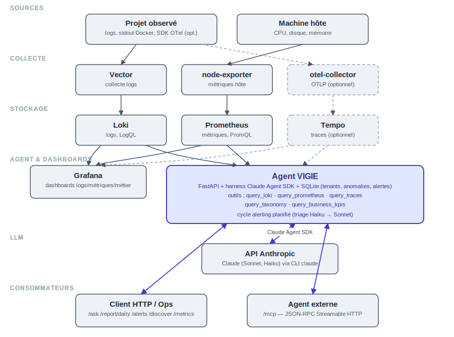

# Guide utilisateur VIGIE

Documentation complète d'installation et d'utilisation de VIGIE — agent d'observabilité
technique et métier, auto-hébergé, branché sur un projet existant sans modifier son code.

Version couverte : **3.0.1**. Pour l'historique des changements, voir le [CHANGELOG](../CHANGELOG.md).
Pour l'état d'avancement technique de la migration du moteur agent, voir
[harness-migration-status.md](superpowers/harness-migration-status.md).

## Sommaire

1. [Présentation](#1-présentation)
2. [Prérequis](#2-prérequis)
3. [Installation](#3-installation)
4. [Vérifier que ça tourne](#4-vérifier-que-ça-tourne)
5. [Authentification et multi-tenant](#5-authentification-et-multi-tenant)
6. [Utilisation — API HTTP](#6-utilisation--api-http)
7. [Utilisation — CLI](#7-utilisation--cli)
8. [Alerting proactif](#8-alerting-proactif)
9. [Intégration MCP (agents externes)](#9-intégration-mcp-agents-externes)
10. [SDK OTel applicatif (optionnel)](#10-sdk-otel-applicatif-optionnel)
11. [Mode mock (dev sans clé API)](#11-mode-mock-dev-sans-clé-api)
12. [Dépannage](#12-dépannage)
13. [Désinstallation](#13-désinstallation)
14. [Références](#14-références)

---

## 1. Présentation

VIGIE surveille un projet en production (technique **et** métier) sans toucher au code
applicatif : il collecte les logs déjà écrits par l'application (fichiers, stdout Docker),
les corrèle avec des métriques système et des traces, et répond en langage naturel via un
agent LLM (Claude, piloté par le [Claude Agent SDK](https://docs.claude.com/en/api/agent-sdk/overview)).

Composants :

| Service | Rôle |
|---|---|
| `vector` | Collecte les logs (fichiers hôte, stdout des conteneurs) et les pousse vers Loki |
| `loki` | Stockage et requêtage des logs (LogQL) |
| `prometheus` + `node-exporter` | Métriques système (CPU, disque, mémoire) |
| `tempo` + `otel-collector` | Traces distribuées (optionnel, si un SDK OTel applicatif est branché) |
| `grafana` | Dashboards (logs, métriques, événements métier) |
| `agent` | API FastAPI + moteur agent (`/ask`, `/report/daily`, alerting, MCP) |



Trois usages principaux :

- **Diagnostic conversationnel** (`POST /ask`) : poser une question en français, l'agent
  interroge Loki/Prometheus/Tempo lui-même et répond FAITS vs HYPOTHÈSES.
- **Taxonomie métier** : l'agent apprend à reconnaître des événements métier (ex.
  `order_created`, `payment_failed`) à partir des logs applicatifs, sans instrumentation.
- **Alerting proactif** : des règles LogQL/PromQL évaluées périodiquement, avec triage
  automatique (Haiku) et notification (Slack/email).

## 2. Prérequis

- Docker + Docker Compose (`docker compose version` ≥ v2)
- Une clé API Anthropic (`ANTHROPIC_API_KEY`) — sauf en [mode mock](#11-mode-mock-dev-sans-clé-api)
  pour évaluer VIGIE sans consommer d'API
- Accès en lecture aux logs du projet observé (chemins montables en volume `:ro`, ou logs déjà
  sur stdout Docker sur la même machine)
- ~2 Go de RAM disponibles pour la stack (Loki + Prometheus + Tempo + Grafana + agent)

## 3. Installation

### 3.1 Cloner et configurer

```bash
git clone <url-du-dépôt> vigie-obs
cd vigie-obs
cp .env.example .env
```

Éditer `.env` :

```bash
ANTHROPIC_API_KEY=sk-ant-...      # clé réelle, ou laisser vide en mode mock
GRAFANA_PASSWORD=change-moi
VIGIE_MOCK_LLM=0                  # 1 = réponses simulées, aucun appel LLM réel
VIGIE_API_TOKEN=                  # optionnel, voir §5
VIGIE_DATA_DIR=./data
VIGIE_ALERT_INTERVAL_MINUTES=10
VIGIE_SLACK_WEBHOOK_URL=          # optionnel, voir §8
VIGIE_SMTP_HOST=
VIGIE_SMTP_PORT=587
VIGIE_SMTP_FROM=
VIGIE_SMTP_TO=
```

> **Note SMTP** : les variables `VIGIE_SMTP_*` sont lues par `agent/config.py` mais ne sont
> pas (encore) propagées au conteneur `agent` dans `docker-compose.yml` — seul
> `VIGIE_SLACK_WEBHOOK_URL` l'est. Pour activer l'alerting par email, ajoute les 4 variables
> correspondantes à la section `environment:` du service `agent` avant de démarrer la stack.

### 3.2 Démarrer la stack

```bash
docker compose up -d --build
```

Ceci construit l'image de l'agent (Python + CLI Node.js `@anthropic-ai/claude-code`, requis
par le harness) et démarre les 8 conteneurs (`vector`, `loki`, `node-exporter`, `prometheus`,
`grafana`, `tempo`, `otel-collector`, `agent`).

Au premier démarrage, l'agent :

- crée la base SQLite (`VIGIE_DATA_DIR/vigie.db`) ;
- seed un tenant `default` (jetons `default-api-token` / `default-mcp-token`, budget LLM
  500 000 tokens) ;
- seed 3 règles d'alerte par défaut (taux d'erreur, CPU, disque).

### 3.3 Brancher la collecte de logs sur le projet observé

Par défaut, `vector` scanne `/var/log`, les logs des conteneurs Docker de l'hôte
(`/var/lib/docker/containers`), et `./lab/stacks` (labs de démo). Pour un vrai projet, deux
options :

1. **Automatique** — lancer la découverte (voir [§7 CLI](#7-utilisation--cli)) qui scanne le
   projet et propose une config `vector.toml` adaptée (chemins détectés, format par source) ;
   relire le diff, puis remplacer `config/vector.toml` par la version validée et
   `docker compose restart vector`.
2. **Manuelle** — éditer directement `config/vector.toml` (voir `config/templates/vector.toml.j2`
   pour la structure attendue) puis `docker compose restart vector`.

## 4. Vérifier que ça tourne

```bash
curl http://localhost:8080/health
# {"status":"ok","service":"vigie-agent","version":"3.0.1"}
```

- Swagger / doc interactive de l'API : http://localhost:8080/docs
- Grafana (dashboards logs/métriques/métier) : http://localhost:3000 (`admin` /
  `GRAFANA_PASSWORD`)
- `docker compose logs -f agent` pour suivre les logs de l'agent
- `docker compose ps` pour l'état de tous les conteneurs

## 5. Authentification et multi-tenant

VIGIE est multi-tenant : chaque tenant a ses propres jetons, son budget LLM et ses données
(anomalies, règles d'alerte, taxonomie) isolés.

### 5.1 Deux mécanismes d'auth, à ne pas confondre

| Mécanisme | Portée | Usage |
|---|---|---|
| `VIGIE_API_TOKEN` (`.env`) | Global, protège toute l'API HTTP si défini | `Authorization: Bearer <VIGIE_API_TOKEN>` sur chaque requête |
| `Tenant.api_token` (par tenant, en base) | Identifie **quel** tenant fait la requête | `Authorization: Bearer <api_token_du_tenant>` (résout automatiquement le tenant), ou header `X-Tenant-ID: <id>` explicite |

Si `VIGIE_API_TOKEN` est vide (défaut), l'API est ouverte sans authentification globale — le
tenant est résolu par `X-Tenant-ID` ou par le jeton `Authorization`, avec repli sur `default`
si aucun des deux n'est fourni. **Pour un déploiement exposé publiquement, définis
`VIGIE_API_TOKEN`.**

### 5.2 Tenant par défaut

Créé automatiquement au premier démarrage : `id=default`, `api_token=default-api-token`.

```bash
curl -X POST http://localhost:8080/ask \
  -H "Content-Type: application/json" \
  -H "Authorization: Bearer default-api-token" \
  -d '{"question": "Y a-t-il des erreurs dans les logs ?"}'
```

### 5.3 Ajouter un tenant

Il n'y a pas encore de route ni de commande CLI dédiée : la création d'un tenant se fait
directement en base, par exemple depuis un shell dans le conteneur agent :

```bash
docker compose exec agent python3 -c "
from agent.db.session import get_session
from agent.db.models import Tenant
with get_session() as s:
    s.add(Tenant(id='acme', name='Acme Corp', api_token='acme-secret', mcp_token='acme-mcp-secret'))
    s.commit()
"
```

`budget_llm_tokens` (défaut 500 000) borne la consommation LLM du tenant ; au-delà,
`/ask`, `/report/daily` et l'alerting renvoient un message d'erreur de budget au lieu
d'appeler le LLM (vérifié en amont de chaque appel, voir `agent/services/tokens.py`).

## 6. Utilisation — API HTTP

Toutes les routes (sauf `/health`) acceptent `X-Tenant-ID: <id>` ou
`Authorization: Bearer <api_token>` pour cibler un tenant (voir §5). Les exemples ci-dessous
utilisent le tenant `default`.

### `GET /health`

Aucune auth. Vérification de vie.

### `POST /ask`

Question en langage naturel, technique ou métier — un seul agent avec accès à Loki,
Prometheus, Tempo, la taxonomie et les KPIs métier répond (boucle Plan-Exécute-Vérifie).

```bash
curl -X POST http://localhost:8080/ask \
  -H "Content-Type: application/json" \
  -H "Authorization: Bearer default-api-token" \
  -d '{"question": "Le taux d'\''erreur a-t-il augmenté cette dernière heure ?"}'
```

Réponse : `{"answer": "...", "tenant_id": "default"}`.

### `GET /report/daily`

Rapport quotidien généré par l'agent : santé technique, activité métier, points d'attention.

```bash
curl -H "Authorization: Bearer default-api-token" http://localhost:8080/report/daily
```

### `POST /discover`

Déclenche une découverte de sources de logs sur une cible (chemin hôte ou nom de conteneur),
équivalent HTTP de la commande CLI `discover` (§7.1).

```bash
curl -X POST http://localhost:8080/discover \
  -H "Content-Type: application/json" \
  -H "Authorization: Bearer default-api-token" \
  -d '{"target": "/srv/mon-projet"}'
```

### `GET /metrics/usage`

Consommation tokens LLM du tenant (100 derniers appels, total, budget restant).

```bash
curl -H "Authorization: Bearer default-api-token" http://localhost:8080/metrics/usage
```

### Alerting — `/alerts/*`

Voir [§8](#8-alerting-proactif) pour le détail des règles ; endpoints :

| Route | Usage |
|---|---|
| `GET /alerts/config` | Liste les règles d'alerte du tenant |
| `POST /alerts/config` | Remplace intégralement les règles du tenant |
| `GET /alerts/history?status=&limit=&offset=` | Historique des anomalies détectées |
| `PATCH /alerts/anomalies/{id}` | Change le statut d'une anomalie (`open`, `investigating`, `resolved`, `ignored`) |

## 7. Utilisation — CLI

Exécution locale (hors conteneur), typiquement pour la phase d'installation/configuration :

```bash
python3 -m venv .venv
.venv/bin/pip install -r agent/requirements.txt
```

### 7.1 `discover` — découverte des sources de logs

```bash
PYTHONPATH=. .venv/bin/python -m cli discover /chemin/projet --tenant default -o config/vector.toml.proposed
```

Scanne la cible en lecture seule (fichiers, ports, conteneurs Docker), échantillonne les
logs trouvés, fait classifier le format de chaque source par l'agent (Symfony, Laravel,
Node, JSON, texte libre...), puis génère une proposition de `config/vector.toml`. Relire le
diff avant d'écraser la config active, puis `docker compose restart vector`.

### 7.2 `taxonomy` — apprentissage des événements métier

Workflow en 4 étapes, à lancer après quelques jours de collecte (pour avoir des logs métier
en base) :

```bash
PYTHONPATH=. .venv/bin/python -m cli taxonomy propose --tenant default
PYTHONPATH=. .venv/bin/python -m cli taxonomy validate --tenant default
PYTHONPATH=. .venv/bin/python -m cli taxonomy diff --tenant default   # optionnel, avant apply
PYTHONPATH=. .venv/bin/python -m cli taxonomy apply --tenant default
```

- `propose` : l'agent interroge lui-même `query_loki` (`stream_type="business"`) sur les
  7 derniers jours et écrit `config/taxonomies/<tenant>.proposed.yaml`.
- `validate` : vérifie que chaque événement proposé a un nom et des patterns.
- `diff` : compare la proposition à la taxonomie déjà appliquée.
- `apply` : active la taxonomie (génère la config VRL de labellisation utilisée par Vector).

Format d'un événement (voir `config/templates/taxonomy.yaml.example`) :

```yaml
events:
  - name: order_created
    patterns: ["commande créée", "order created"]
    description: Commande créée
```

Une fois appliquée, la taxonomie alimente `query_taxonomy`/`query_business_kpis` (utilisés
par `/ask` et `/report/daily`) et les dashboards Grafana métier.

## 8. Alerting proactif

Cycle planifié toutes les `VIGIE_ALERT_INTERVAL_MINUTES` minutes (défaut 10) :

1. Chaque règle activée (`GET /alerts/config`) est évaluée (requête LogQL ou PromQL réelle).
2. Si le seuil est dépassé, un modèle léger (Haiku) trie bruit vs anomalie réelle.
3. Une vraie anomalie crée une entrée (`GET /alerts/history`) et notifie les canaux
   configurés (Slack si `VIGIE_SLACK_WEBHOOK_URL` est défini, email si les `VIGIE_SMTP_*`
   sont configurés — voir la note §3.1 sur leur propagation dans `docker-compose.yml`).
4. Un cooldown (`cooldown_minutes` par règle) évite de re-notifier la même signature en boucle.

Règles par défaut (seedées à l'initialisation, tenant `default`) :

| Règle | Type | Requête | Seuil | Cooldown |
|---|---|---|---|---|
| `error_rate` | logql | `sum(count_over_time({level="error"}[5m]))` | 10 | 60 min |
| `cpu_high` | promql | `100 - (avg(rate(node_cpu_seconds_total{mode="idle"}[5m])) * 100)` | 90 | 60 min |
| `disk_low` | promql | `% espace disque libre sur /` | 10 | 120 min |

Remplacer les règles d'un tenant :

```bash
curl -X POST http://localhost:8080/alerts/config \
  -H "Content-Type: application/json" \
  -H "Authorization: Bearer default-api-token" \
  -d '{
        "rules": [
          {"name": "error_rate", "rule_type": "logql",
           "query": "sum(count_over_time({level=\"error\"}[5m]))",
           "threshold": 20, "cooldown_minutes": 30}
        ],
        "slack_webhook": null
      }'
```

## 9. Intégration MCP (agents externes)

VIGIE expose un vrai serveur MCP (protocole JSON-RPC, transport Streamable HTTP) sous
`/mcp`, pour brancher un agent externe (ex. un agent ETECH côté client).

- Auth : `Authorization: Bearer <mcp_token>` du tenant (distinct de son `api_token`).
- Outils : `get_project_health(hours=24)`, `query_incidents(hours=168, status=None)`,
  `get_business_kpis(hours=24)`, `explain_anomaly(anomaly_id=None, question=None)`.

```python
from mcp import ClientSession
from mcp.client.streamable_http import streamablehttp_client

async with streamablehttp_client(
    "http://localhost:8080/mcp", headers={"Authorization": "Bearer default-mcp-token"}
) as (read, write, _get_session_id):
    async with ClientSession(read, write) as session:
        await session.initialize()
        result = await session.call_tool("get_project_health", {"hours": 24})
```

Détails complets : [mcp-integration.md](mcp-integration.md).

## 10. SDK OTel applicatif (optionnel)

Pour enrichir le diagnostic avec des traces distribuées réelles (au lieu des seuls logs),
un SDK OTel léger peut être ajouté au code applicatif (aucune modification structurelle
requise) :

**Symfony**
```php
use Etech\VigieOtel\VigieOtel;
VigieOtel::init('mon-app', tenantId: 'acme');
```

**Node**
```js
const { initVigieOtel } = require('@etech/vigie-otel');
initVigieOtel({ serviceName: 'mon-api', tenantId: 'acme' });
```

Les traces remontent via `otel-collector` (ports 4317 gRPC / 4318 HTTP) vers Tempo, et
deviennent disponibles à l'agent via l'outil `query_traces`. Sans ce SDK, VIGIE fonctionne
normalement sur logs + métriques seuls.

## 11. Mode mock (dev sans clé API)

`VIGIE_MOCK_LLM=1` (dans `.env`, avant `docker compose up`) fait répondre chaque preset
agent (`ask`, `diagnostic`, `triage`, `taxonomy`, `discovery`) avec une réponse fixe simulée,
sans appel réseau à Anthropic ni au CLI `claude`. Utile pour valider l'installation, les
endpoints HTTP et l'intégration MCP sans consommer de budget API. Le contrat de chaque
endpoint (forme de la réponse JSON) est identique en mock et en réel.

## 12. Dépannage

| Symptôme | Cause probable | Solution |
|---|---|---|
| `/ask` renvoie `Erreur harness agentique : Command failed with exit code 1` | Le CLI `claude` refuse `bypassPermissions` en root | Vérifier que `IS_SANDBOX=1` est bien dans l'environnement du conteneur `agent` (déjà le cas depuis 3.0.1) |
| `vigie-loki` redémarre en boucle (`docker compose ps` montre `Restarting`) | `retention_enabled: true` sans `delete_request_store` dans `config/loki.yaml` | Vérifier que `delete_request_store: filesystem` est présent (déjà le cas depuis 3.0.1) ; `docker compose logs loki` affiche l'erreur de validation exacte sinon |
| `/ask` répond que Loki/Prometheus sont injoignables alors qu'ils tournent | Pas encore de données collectées (stack fraîchement démarrée), ou `vector.toml` mal ciblé | `docker compose logs vector` ; vérifier que les chemins montés dans `docker-compose.yml` couvrent bien le projet observé (§3.3) |
| `401 Token API invalide` | `VIGIE_API_TOKEN` défini mais jeton absent/faux dans la requête | Ajouter `Authorization: Bearer <VIGIE_API_TOKEN>` |
| Réponse `Budget LLM épuisé` | `Tenant.tokens_used >= budget_llm_tokens` | Relever `budget_llm_tokens` en base pour ce tenant, ou attendre une remise à zéro manuelle |
| Alerting email jamais envoyé | `VIGIE_SMTP_*` non propagés au conteneur | Voir note §3.1 — ajouter les variables à `docker-compose.yml` |

Pour toute anomalie côté harness agentique (comportement inattendu du modèle, nouveaux
messages d'erreur du CLI), voir la méthodologie de debug et les faits SDK déjà établis dans
[harness-migration-status.md §4](superpowers/harness-migration-status.md#4-faits-techniques-confirmés-à-ne-pas-re-découvrir).

## 13. Désinstallation

```bash
docker compose down -v   # supprime aussi les volumes (données Loki/Prometheus/Grafana/agent)
./lab/teardown.sh        # si les labs de démo (lab/stacks) ont été utilisés
```

Réversibilité zéro-code côté projet observé : VIGIE ne modifie jamais le code applicatif.
Si le SDK OTel (§10) a été ajouté, le retirer via Composer/npm selon l'écosystème.

## 14. Références

- [CHANGELOG](../CHANGELOG.md) — historique des versions
- [README](../README.md) — vue d'ensemble et démarrage express
- [Intégration MCP](mcp-integration.md) — détail protocole/auth pour agents externes
- [Guide opérateur](runbooks/guide-operateur.md) — check-list courte discover → validate → up
- [Installation V1](runbooks/install-v1.md) / [V2](runbooks/install-v2.md) — versions courtes historiques
- [Migration harness Claude Agent SDK](superpowers/harness-migration-status.md) — détails techniques internes du moteur agent
